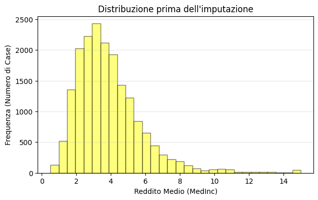
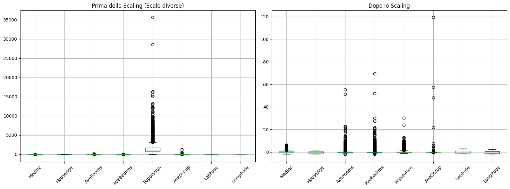
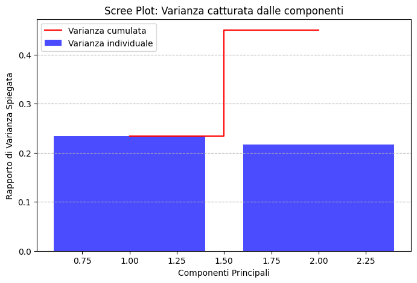
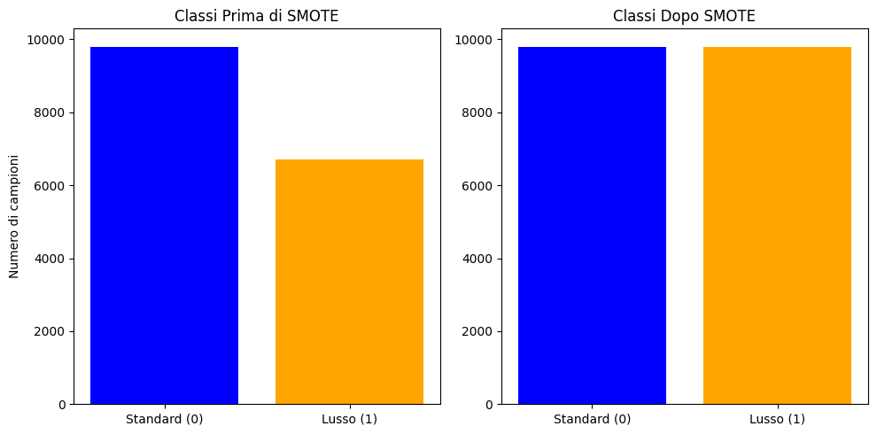

# California-Housing-Preprocessing-AI
Esercitazione di preprocessing, visualizzazione e machine learning workflow sul dataset California Housing

# Preprocessing e Visualizzazione Dati - California Housing

Questo repository contiene un'esercitazione strutturata in 4 fasi per il consolidamento delle competenze di preparazione dei dati nel Machine Learning.

##  Tecniche Utilizzate
- **Gestione Dati Mancanti**: Imputazione univariata tramite mediana per garantire robustezza agli outlier.
- **Feature Transformation**: One-Hot Encoding per variabili categoriche e Standardizzazione (StandardScaler) per feature numeriche.
- **Riduzione della Dimensionalità**: Applicazione della PCA (2 componenti) con analisi della varianza spiegata.
- **Gestione Sbilanciamento**: Trasformazione in problema di classificazione e bilanciamento tramite tecnica **SMOTE**.
- **Workflow**: Implementazione di Scikit-Learn Pipeline per garantire la riproducibilità ed evitare il data leakage.

## Visualizzazioni
 (images/imputazione.png)

 (images/scatter_plot.png)

